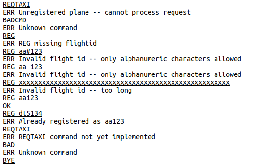

# CSC 362 Project - Spring 2026

## Project description

This repository is for your three-part CSC 362 project. The final project, which will be a multithreaded, networked air traffic ground control server, will be due at midnight April, 27th. This assignment is different from the assignments you have been doing in a few fundamental ways:

* While you may communicate and collaborate (in a limited way) with
  others on the weekly assignments, this project is for you to
  complete *on your own*. The purpose is for you to demonstrate what
  you've learned and what you can do in a system programming setting,
  and your work on this project should not be discussed with other
  students. If you run into issues, you can ask questions of the
  instructor or the grader.

* While some code will be provided to you, the programming tasks are
  larger and more in-depth than your weekly assignments. The project
  does draw heavily on previous class work and weekly assignments (for
  example, you will be provided with a thread-safe array list
  implementation), so make sure to think about what previous code 
  you can re-use in your project and integrate that into your project.

* To make sure you can proceed to later parts of the assignment, since
  each part builds upon the previous one, the instructor solution for
  parts 1 and 2 will be released after the late submission date for
  each part has passed. If you struggle with one of those parts, 
  you'll have a week to either use ideas from the posted solution to 
  improve your code, or you can simply use the instructor solution in 
  its entirety. You'll lose a week of working time if you start from 
  that code, but if you can't rescue your work from a previous part 
  this might be the best way for you to move forward.

* All submissions will be through Canvas.

## High-Level Project Overview

The end product of this project will be an air traffic "ground
control" server, that tracks airplanes on the ground at an airport,
and grants permission for planes to taxi and takeoff. The basic way
this operates is that each airplane is a network client that connects
to the server you are writing, and the server handles commands and
requests from the planes. In the end, it will be a full multithreaded
network server that implements an application-layer protocol for
airplane-to-server communication, but the project will be accomplished
in three pieces -- the first of which does not involve threads or
networking, so we'll build up capabilities slowly. The full
application-level protocol is defined in the final section of this
README, and while you won't implement it all at once you should read
through it carefully before you start coding on Part 1.

**Important:** The server is *not* a program that interacts with a
human user. While that's the way you'll test it, the design is for a
server program that talks with *client programs* in the planes. What
this means is that the communication must be *EXACTLY* as defined
below in the section "Application Layer Protocol". Do not improvise!
Do not add extra "helpful" output or prompts or "welcome" messages or
anything like that. While those might be useful for a program that
interacts with a human, it is incorrect in an application level
protocol that must follow the definition precisely so that different
programs can interact with each other.

**Quality reminder:** While there's a lot of functionality to
implement here, keep in mind that in a 300-level class (and even more
so in the work world!), you're expected to write *good* code, which
means good style, good design, and good documentation. Your code should be
robust (handling errors gracefully) and should manage memory
properly. Remember to check with Valgrind to make sure you don't have
any memory leaks, and carefully think through how things can go wrong.

**Project difficulty:** The project requires you to write a
non-trivial amount of code, as compared to the weekly assignments. Get
started on each part as soon as you can so you don't run out of time!
In order to gauge the difficulty of each part and what is expected,
here are the number of new lines of code that were added for each part
in the instructor's solution:

* Part 1: 56 lines of code
* Part 2: 162 lines of code (half is networking code from class examples)
* Part 3: 143 lines of code

Of course, lines of code don't tell the entire story. There are thread
management issues that come up that need to be carefully thought
through, so it's not just a matter of cranking out lines of code.

## Part 1 (v0.1): Creating the basic command processor

For the first part of the project development, you should spend some
time studying the "Application Layer Protocol" given below and study
the provided code to understand how everything is designed. At this
point there is no networking, and only one plane will "talk" with the
server using console I/O, and the provided "main" function in
`gndcontrol.c` sets this up. The string parsing code in the
`docommand` function in `airs_protocol.c` is particularly important to
study and understand. Once you've got a good understanding of what has
been provided, you are to expand the code so that it recognizes all of
the commands in the final application layer protocol, although only
"REG" and "BYE" need to be fully implemented. For the others, simply
put in a check to make sure the plane is registered, and give an
appropriate error message if it is not. If the plane *is* registered,
just output an "ERR" message saying the command is not implemented
yet.

For the "REG" command, you need to check if the plane is not currently
registered, that an argument was given, that the argument is in the
right form (all alphanumeric characters), and is within the length
bound. If any of these conditions is not met, output an error
message. To check characters in the string, see the man page for
`isalnum`. If all is OK, then copy the flightid into the `id` field
of the `airplane` struct and change the state appropriately and
respond with an "OK" message. The following transcript shows how the
program should behave in v0.1, where client (typed) input is
underlined, and other lines come from the server. Notice that it
recognizes actual commands, even if it doesn't implement them, and
recognizes whether the plane is registered or not.



You also need to implement the "BYE" command, which simply sets the
plane state to `PLANE_DONE` which will exit the loop in `main`.

## Part 2 (v0.2): Creating the network server and communication threads

For the second phase of the assignment, you should implement the
networking part of the project, and build an airplane tracking list on
top of use a provided generic thread-safe arraylist to keep track of
airplanes. To get the arraylist implementation, get the "C-ArrayList"
repository from the class organization. Copy the `alist.h` and
`alist.c` files from that repository directly into the `src` directory
of your project, update your `Makefile`, and then do a `git add` so
they are included in your project.

From a networking standpoint, for an airplane to join the system, it
connects to the server using a TCP stream on server port 8080.  Each
connection corresponds to a different plane and should be handled in
its own thread. The "read loop" that was provided to you for Part 1
should be moved from `main` into the thread handler, since each
connection needs its own read loop. The main program will then be the
basic TCP server setup and listener code, just like the examples in
class. Here are a few important points to guide your development:

* A connection should be cleanly shut down when either the server
  receives a "BYE" command or the client disconnects (which you can
  detect by a failed `getline` call). That means that the lifetime of
  each thread is unpredictable, and using `pthread_join` to clean up
  after these threads is difficult. However, you can't just ignore
  this, or the thread will hold on to some resources as a "thread
  zombie," and you'll have a memory leak! An easy way to solve this
  problem is to call `pthread_detach()` in each thread after it
  starts. This basically says that when a thread is finished, all
  resources can be freed up, and it will not create a zombie
  thread. Check the `pthread_detach` man page for usage info.

* In part 1, the single session was connected to the `stdin` and
  `stdout` streams. In this part, you need to set the `fd_send` and
  `fd_recv` file handles after accepting a network connection. These
  should be separate, independent sending and receiving file handles,
  and yet `accept()` only creates a single socket file descriptor for
  both reading and writing. The right way to handle this is to call
  `dup()` on the file handle given by `accept()` to get two
  kernel-level file descriptors, and then use `fdopen` *twice* to
  create FILE objects on each file descriptor -- one just for reading
  (for `fd_recv`), and one just for writing (for `fd_send`). These
  should be set in the `airplane` structure when it is initialized so
  that subsequent I/O goes to the right place.

* Buffering in a FILE stream can be awkward, but since this is a
  line-oriented protocol the file handles can be set to be line
  buffered to avoid problems. See the `setvbuf()` function for how to
  do this.

As mentioned above, you also need to incorporate the provided
thread-safe, generic array list to keep track of airplanes.  You
should use this to maintain a list of `airplane` structs, and I would
suggest (although not require) that you create a new module in your
project that manages this list of airplanes. The rest of the program
then would never touch the "alist" type at all, but would call
functions in your new module every time a list operation needs to be
performed. Whenever a new client connects, part of the client
initialization should include adding the initialized `airplane` struct
to a global list of all airplanes in the system. You should also create a
function that searches the list for specific flightids, and using that
you should modify the "REG" command to give an error message if an
airplane tries to register with the same flightid as another airplane.

There are many subtle race conditions that must be considered for your
assignment to be truly thread-safe.  It is really hard to eliminate
all these issues (or even reliably detect them in testing), so your
projects will not be graded harshly for these issues. However, while
these might *seem* unlikely to occur, they are important -- if you
were producing professional-grade software (which many of you may be
doing in 5 years!) then releasing something that has one of these
"seeminly unlikely" bugs in it is something that could cost your
company a lot of money and/or grief. Consider:

* What if one thread is in the process of changing a flightid (because
  of a "REG" command) while another thread is scanning the list
  looking for a particular flightid?

* What if a new plane being added to the list, or a plane is being
  removed from the list, while another thread is iterating through the
  list looking for a flightid?

* What if two planes disconnect around the same time and they are both
  being removed from the list at the same time? Since the arraylist
  removes by position in the list, could a plane that started out
  being in position 6 be in position 5 before the end of the operation
  (so you end up removing the wrong plane)?

The bottom line is this: you shouldn't be able to scan or modify the
list if some other thread is modifying either the list structure or
the names on the list. An easy protection for this is to include a
global lock that protects the global airplane list.

## Part 3 (v1.0): Completing the server

For this part, you need to complete the ground control server,
bringing it up to v1.0 -- ready to release to the world! The big
addition here is capabilities to manage the takeoff queue for the
runway, which grants permission for takeoff (with the appropriate
safety delay) and answers queries about the queue (the REQPOS and
REQAHEAD queries).

While there are several designs that are possible, one of the best is
to create a new module to manages the queue, and includes its own
"queue manager" thread that controls takeoff permissions. The
functions in this module then can appropriately lock/unlock the queue
to make everything thread-safe. One more tip: Just keep flightids
(strings) in the queue, not pointers to airplane objects. This means
you have to look up the flight in the plane list every time you need
to change its state or send a message, but it protects against the
plane disconnecting and the airplane object being freed up while the
queue is still holding a pointer to it.

*The queue manager thread:* The rule for flights is that take-offs
must be spaced out by a minimum amount of time. In the real world that
might be 90 second spacing (depending on airplane type and wake
turbulence), but in our server we'll make that a shorter 4 second time
delay so we don't have to wait so long.  The queue manager thread will
clear the first flight in the takeoff queue (or wait until there is a
flight in the queue) and then wait until it gets the "INAIR" command
from that flight. Note that "wait" should not be a busywait -- in both
of those "wait" situations, use a condition variable! After the queue
manager is notified of an "INAIR" command, it should sleep for the 4
second safety interval before looping back to handle the next flight
in the takeoff queue.

## The Application Layer Protocol

The air traffic server uses a line-based application-layer network
protocol. Airplanes connect to the server, and messages from the
airplane to the controller and from the controller to the airplane are
single lines of text. An airplane can make a request (e.g., ask to
taxi from the terminal) using a line in which the first word is a
command possibly with some optional arguments as described below.  The
status of an airplane, and all the data necessary for communication
between the server and the airplane, is in the `airplane` data type,
defined in `airplane.h`. The provided structure definition has
everything you need for Part 1 of the assignment, but you might need
to add additional fields for later parts.

At any point in time, every airplane that is part of the system has a
current state, which is one of six possible values. These values are
defined in `airplane.h` and the current state for each airplane in the
`state` field of the `airplane` structure. The states are as follows:

* `PLANE_UNREG` - the initial state of a plane when it contacts ground
  control, meaning that the plane is unregistered and parked at the
  terminal. A plane must register and give a flight number/id before
  any other command will be accepted.

* `PLANE_DONE` - this is a special state in which the airplane has
  indicated that it is done interacting with ground control, either
  because it has taken off (and air control will take over) or it is
  parked at the terminal and doesn't want to interact any more.

* `PLANE_ATTERMINAL` - this is the state of a plane that has
  registered with ground control (so has a flight number) but is still
  parked at the terminal.

* `PLANE_TAXIING` - this is the state of a plane that has requested
  permission to taxi, and has received that permission from ground
  control.

* `PLANE_CLEAR` - this is the state of a plane that has reached the
  front of the taxi list, and has been cleared to take off.

* `PLANE_INAIR` - this is the state of a plane that has taken off. A
  plane in this state will transition to the `PLANE_DONE` state
  automatically.

There are six commands or requests that an airplane can send to ground
control. Each command is sent on a single line from the airplane to
the server, with a command *exactly* as listed below (including
capitalization) and any necessary arguments on the same line separated
by at least one space from the command. When the server receives a
command, it will always respond with either "OK" on a line by itself,
or if there is something wrong with the command then the server
responds with a line beginning with "ERR", followed by a space and a
single-line free-form (human understandable) description of the
error. For example, if the airplane issues the command "REG aa#123"
then the server could respond with

```
ERR Invalid flight id -- only alphanumeric characters allowed
```

Here is a complete list of commands that the airplane can send to
ground control:

* `REG flightid` \
  Register the plane as a given "flightid", where flightid is a unique
  identifier for the airplane (like aa1534). "flightid" must be a
  single word (no spaces) consisting of only alphanumeric
  characters. It can be at most `PLANE_MAXID` characters long (defined
  in `airplane.h`). A command with a missing or invalid flightid must
  be rejected by the server as an error. This command can only be
  issued if the airplane is in the `PLANE_UNREG` state, and success
  will result in the plane being transitioned to the
  `PLANE_ATTERMINAL` state.

* `REQTAXI`\
   This request (with no arguments) can only be accepted from a plane
   that is in state `PLANE_ATTERMINAL`, and takes no
   arguments. Success will transition the plane from the
   `PLANE_ATTERMINAL` state to the `PLANE_TAXIING` state. Internally,
   the server will add this plane to the end of a "taxi queue" that
   keeps track of the line of planes waiting to take off.

* `REQPOS`\
  This request (with no arguments) can only be accepted from a plane
  that is in state `PLANE_TAXIING`, and in that case the server will
  respond with a message of the form "OK #" (for example, "OK 3") that
  says what position the plane is in for takeoff. Position 1 is either
  a plane that is in the `PLANE_CLEAR` state (cleared for take-off),
  or if no such plane exists then it is the first plane in the taxi
  queue. Positions numbered 2 or higher are all in the taxi queue (so
  in state `PLANE_TAXIING`). Once a plane goes airborne and
  transitions to the `PLANE_INAIR` state, it will no longer be counted
  as ahead of this plane.

* `REQAHEAD`\
  This request (with no arguments) can only be accepted from a plane
  that is in state `PLANE_TAXIING`, and is a request for the flight
  ids of all airplanes ahead of this one in the taxi queue. This is
  related to the `REQPOS` command position, but is a list of the
  planes rather than just a position number. The response (with the
  "OK" code) is a list of all flights ahead of this one, in order of
  take-off position) separated by commas. For example, if a plane is
  in the third position, with two flights ahead of it, then the
  server's response could look something like "OK dl1523, aa632" where
  dl1523 is the next plane that will be cleared for takeoff.

* `INAIR`\
  This is the command that the airplane issues to indicate that it has
  taken off, and can only be issued by a plane in the `PLANE_CLEAR`
  state. This will transition the plane to the `PLANE_INAIR` state, at
  which point it transitions to the `PLANE_DONE` state and disconnects
  from the server.

* `BYE`\
  This command is issued by a plane, in any state, to disconnect from
  the server. If the plane is in a taxi queue it must be removed
  before its `airplane` object is destroyed.

The server can send the following message to an airplane:

* `TAKEOFF`\
  This message can be sent to the plane in "position 1" in the
  take-off queue, to let it know that it is clear to take off. See
  "Part 3" for information on when this message should be sent. When
  this message is sent, the airplane that it is sent to should change
  from state `PLANE_TAXIING` to `PLANE_CLEAR`.

* `NOTICE`\
  This indicates a message for the pilot, which follows the word
  "NOTICE". This doesn't actually do anything in our simulation, but
  is a nice way to disconnect from a plane. The only use currently is
  for the server to send

  ```
  NOTICE Disconnecting from ground control - please connect to air control
  ```

  after a plane takes off (after they report "INAIR").
  